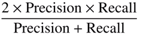

# eCommerceRecommendationEngine
Building a "Did you forget" Recommendation System for an e-commerce business that sells groceries [Unsupervised Machine Learning] [Association Rules, Collaborative Filtering]

## Problem Statement

In the highly competitive online grocery delivery market, ensuring a seamless and customer-centric shopping experience is crucial. A common issue faced by customers is forgetting to purchase essential items. To address this, your task is to design and implement a "Did You Forget?" system that assists users by suggesting items they may have forgotten to add to their cart before checking out.

Develop a machine learning-based recommendation system that identifies and suggests items likely forgotten by customers based on their shopping behavior, past purchases, and current cart contents.

## Evaluation

The results or effectiveness of the Recommendation System will be evaluated with a test set using F1-score@5 metrics. F1-Score metrics will be measured using:

Where precision and recall are measured @5.